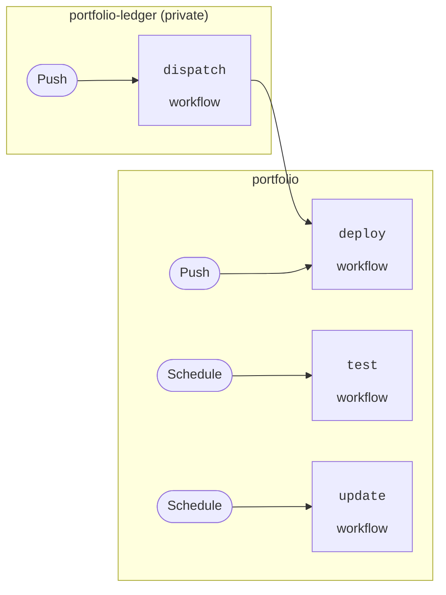

# Portfolio

Serverless investment portfolio management.


## Summary

This project assists with investment portfolio management.
It retrieves account balances from financial institutions and deploys a web
application summarising the actions required to [rebalance](https://www.bogleheads.org/wiki/Rebalancing)
the portfolio.

You can take a look at a demo deployment [here](https://portfolio-demo.brodie.id.au).

The project is comprised of several pieces working together:
- A GitHub Actions workflow periodically runs [Python code](portfolio) to retrieve account balances.
- Balances and asset prices are stored in a plain text [Beancount](https://beancount.github.io) ledger.
- [AWS Cloud Development Kit](https://docs.aws.amazon.com/cdk/v2/guide/home.html) is used to define the cloud application in [code](cdk).
- [Datasette](https://datasette.io) transforms data in the Beancount ledger into an interactive website.
- [Mangum](https://mangum.io) allows the Datasette web application to run on AWS Lambda, resulting in a practically zero-cost deployment.


## Contents

- [Summary](#summary)
- [Contents](#contents)
- [How-to guides](#how-to-guides)
  - [How to set up a local development environment](#how-to-set-up-a-local-development-environment)
  - [How to activate Mamba environment](#how-to-activate-mamba-environment)
  - [How to update Node.js](#how-to-update-nodejs)
  - [How to update AWS CDK Toolkit](#how-to-update-aws-cdk-toolkit)
  - [How to update AWS Construct Library](#how-to-update-aws-construct-library)
  - [How to update Python dependencies](#how-to-update-python-dependencies)
  - [How to update Lambda function Python dependencies](#how-to-update-lambda-function-python-dependencies)
  - [How to serve Datasette locally](#how-to-serve-datasette-locally)
  - [How to rotate personal access tokens](#how-to-rotate-personal-access-tokens)
    - [portfolio/actions/write](#portfolioactionswrite)
    - [portfolio-ledger/contents/write](#portfolio-ledgercontentswrite)
  - [How to update ubank trusted cookie](#how-to-update-ubank-trusted-cookie)
- [Explanation](#explanation)
  - [Storing secrets](#storing-secrets)
  - [Datasette authentication](#datasette-authentication)
  - [Embedding a dashboard in Datasette's index page](#embedding-a-dashboard-in-datasettes-index-page)
  - [Lambda function performance](#lambda-function-performance)
  - [GitHub Actions workflows](#github-actions-workflows)
    - [test](#test)
    - [update](#update)
    - [deploy](#deploy)
    - [dispatch (in portfolio-ledger)](#dispatch-in-portfolio-ledger)
  - [Authenticating GitHub Actions workflows with AWS](#authenticating-github-actions-workflows-with-aws)
  - [Routing GitHub Actions traffic via a Tailscale exit node](#routing-github-actions-traffic-via-a-tailscale-exit-node)
- [Reference](#reference)
  - [GitHub personal access tokens](#github-personal-access-tokens)
  - [GitHub Actions secrets](#github-actions-secrets)
  - [AWS Parameter Store parameters](#aws-parameter-store-parameters)


## How-to guides

### How to set up a local development environment

Create the `portfolio` Mamba environment defined in `environment.yml`:

```bash
micromamba create --file environment.yml --yes
```

Activate the `portfolio` environment:

```bash
micromamba activate portfolio
```

Install Node.js dependencies:

```bash
npm ci
```

Install Python dependencies:

```bash
poetry install
```

Install Lambda function Python dependencies:

```bash
cd cdk/function
poetry install
cd -
```


### How to activate Mamba environment

Activate the `portfolio` environment with the following command:

```bash
micromamba activate portfolio
```

### How to update Node.js

Pin the `nodejs` dependency in [environment.yml](environment.yml) to the active LTS version listed on [this page](https://nodejs.org/en/about/previous-releases).


### How to update AWS CDK Toolkit

Install the latest version of AWS CDK Toolkit:

```bash
npm install aws-cdk
```


### How to update AWS Construct Library

Update *just* the AWS Construct Library (`aws-cdk-lib`):

```bash
poetry update aws-cdk-lib
```


### How to update Python dependencies

Update Python dependencies to their latest versions (according to version constraints in `pyproject.toml`):

```bash
poetry update
```


### How to update Lambda function Python dependencies

Update Lambda function dependencies defined in separate directory:

```bash
cd cdk/function
poetry update
cd -
```


### How to serve Datasette locally

Build an SQLite database from a Beancount ledger using commands almost identical to those in the [deploy](.github/workflows/deploy.yml) workflow:

```bash
micromamba activate portfolio
bean-sql ../portfolio-ledger/portfolio.beancount cdk/function/portfolio.db
sqlite3 cdk/function/portfolio.db < ../portfolio-ledger/target_allocation.sql
sqlite3 cdk/function/portfolio.db < tables.sql
```

Run the Datasette web application locally using the following command.
Changes to `metadata.yml` will restart the web application, which is useful when developing dashboards.
GitHub authentication is not configured as opposed to the production application deployed to AWS.

```bash
datasette cdk/function/portfolio.db --reload --metadata cdk/function/metadata.yaml
```


### How to rotate personal access tokens

Complete the following steps after an expiry notification is received.


#### portfolio/actions/write

- [Regenerate the token](https://github.com/settings/personal-access-tokens/3189417).
- Update portfolio-ledger's [TOKEN](https://github.com/eidorb/portfolio-ledger/settings/secrets/actions/TOKEN) repository secret.


#### portfolio-ledger/contents/write

- [Regenerate the token](https://github.com/settings/personal-access-tokens/3189407).
- Update portfolio's [TOKEN](https://github.com/eidorb/portfolio/settings/secrets/actions/TOKEN) repository secret.


### How to update ubank trusted cookie

The ubank trusted cookie object may have to be manually updated from time to time.
Obtain a new trusted cookie object using the `ubank` module:

```console
$ read -s PASSWORD
SecretPassw0rd
$ python -m ubank name@domain.com "$PASSWORD"
Enter security code: 123456
{'name': '026d9560-3c86-4680-b926-44bdd28eba94', 'value': 'YmxhaCBibGFoIGJsYWggYmxhaCBibGFoIGJsYWggYmxhaCBibGFo', 'domain': 'www.ubank.com.au', 'path': '/', 'expires': 1706758407, 'httpOnly': True, 'secure': True, 'sameSite': 'Strict'}
```

Replace the cookie object in [secrets.py](portfolio/secrets.py) with the new one.


## Explanation

### Storing secrets

Credentials used to authenticate with financial institutions are stored in [this repository](portfolio/secrets.py) 😱.
This makes it a breeze to develop and test things locally.

Encryption and decryption is handled using [git-crypt](https://www.agwa.name/projects/git-crypt/).
GitHub Actions workflows decrypt the secrets file when required.


### Datasette authentication

This application serves financial information over the internet.
The Datasette plugin [datasette-auth-github](https://datasette.io/plugins/datasette-auth-github)
is used to control access to the application.

The OAuth application [Portfolio Datasette](https://github.com/settings/applications/1931808)
was registered on GitHub, with *Authorization callback URL* set to `https://portfolio.brodie.id.au/-/github-auth-callback`.

The [Lambda function](cdk/function/index.py) configures the plugin's OAuth client
ID and secret settings with values retrieved from Parameter Store.

Access is restricted to my GitHub user ID.
Forbidden requests are redirected to the GitHub auth page using the [datasette-redirect-forbidden](https://datasette.io/plugins/datasette-redirect-forbidden)
plugin.


### Embedding a dashboard in Datasette's index page

Portfolio information is summarised in dashboard charts using the [datasette-dashboards](https://datasette.io/plugins/datasette-dashboards) plugin.
This information should be visible on the index page, rather than having to navigate to the dashboard page.

datasette-dashboards documentation suggests using `<iframe>` elements to embed dashboards and charts in HTML.
However, it was difficult to achieve a responsive layout without scrollbars using this approach.
Instead, a subset of elements from the dashboard page are included in the index page's HTML.
Datasette's index page is customised using the `description_html` [metadata](https://docs.datasette.io/en/stable/metadata.html) property.

The [Datasette CLI](https://docs.datasette.io/en/stable/cli-reference.html#datasette-get) and `extract-dashboard.py` script is used to extract HTML elements from the dashboard page.

The following command extracts dashboard HTML elements to the clipboard for easy pasting into `metadata.yaml`:

```bash
datasette serve \
  --get https://portfolio.brodie.id.au/-/dashboards/portfolio \
  --metadata cdk/function/metadata.yaml \
  cdk/function/portfolio.db | \
python extract-dashboard.py | \
pbcopy
```

This command does the same for the demo application:

```bash
datasette serve \
  --get https://portfolio-demo.brodie.id.au/-/dashboards/portfolio \
  --metadata cdk/function/metadata.yaml \
  cdk/function/portfolio.db | \
python extract-dashboard.py | \
pbcopy
```


### Lambda function performance

Lambda allocates CPU proportional to the amount of memory configured. Request durations of multiple seconds were observed with the default setting of 128 MB. Occasional timeouts occurred when the default timeout of 3 seconds was exceeded.

Setting memory size to 1024 MB resulted in much shorter durations: 100 ms or less. Costs should be comparable or even reduced as we're using more expensive compute but for less time.


### GitHub Actions workflows

This section describes the workflows used by this project.




#### [test](.github/workflows/test.yml)

Financial institution's websites/APIs are subject to change.
This workflow runs [pytest tests](tests/) fortnightly.
A failed test workflow indicates that something on the financial institution's end has changed and the code needs to be fixed.


#### [update](.github/workflows/update.yml)

This workflow updates the Beancount ledger in [portfolio-ledger](https://github.com/eidorb/portfolio-ledger)
with the latest balances and asset prices.

It is scheduled to run approximately every 10 days.


#### [deploy](.github/workflows/deploy.yml)

This workflow converts a Beancount ledger contained in the private [portfolio-ledger](https://github.com/eidorb/portfolio-ledger)
repository to an SQLite database and then deploys the CDK application to AWS.

It is triggered when changes are pushed to this repository or the [portfolio-ledger](https://github.com/eidorb/portfolio-ledger)
repository.


#### dispatch (in [portfolio-ledger](https://github.com/eidorb/portfolio-ledger))

This workflow triggers the [deploy](.github/workflows/deploy.yml) workflow when
changes are pushed to [portfolio-ledger](https://github.com/eidorb/portfolio-ledger),
regardless of whether the changes were manual or automatic.


### Authenticating GitHub Actions workflows with AWS

My [AWS account](https://github.com/eidorb/aws) was [configured](https://docs.github.com/en/actions/deployment/security-hardening-your-deployments/configuring-openid-connect-in-amazon-web-services)
to trust GitHub's OpenID Connect (OIDC) provider.
This allows workflows to deploy to AWS without using long-lived credentials.


### Routing GitHub Actions traffic via a Tailscale exit node

Some financial institution's websites behave differently when accessed from the
GitHub Actions network, likely due to overly sensitive anti-bot protection. Code that would successfully retrieve a balance when run on a computer at home would fail when run on GitHub Actions.

To work around this, the [deploy](.github/workflows/deploy.yml) and [test](.github/workflows/test.yml)
workflows connect to a Tailscale network and route traffic via an exit node at home.


## Reference

### GitHub personal access tokens

| Name                                                                                          | Description                                                                                                                                                                                                                                                                            |
| --------------------------------------------------------------------------------------------- | -------------------------------------------------------------------------------------------------------------------------------------------------------------------------------------------------------------------------------------------------------------------------------------- |
| [portfolio-ledger/contents/write](https://github.com/settings/personal-access-tokens/3189407) | Grants `contents:write` access to [portfolio-ledger](https://github.com/eidorb/portfolio-ledger) repository. Used by [update](.github/workflows/update.yml) workflow to update Beancount ledger, and by [deploy](.github/workflows/deploy.yml) workflow to check out portfolio-ledger. |
| [portfolio/actions/write](https://github.com/settings/personal-access-tokens/3189417)         | Grants `actions:write` access to this repository. Used by [portfolio-ledger](https://github.com/eidorb/portfolio-ledger)'s dispatch workflow to trigger this repository's [deploy](.github/workflows/deploy.yml) workflow.                                                             |


### GitHub Actions secrets

The following secrets were created in the [repository](https://github.com/eidorb/portfolio/settings/secrets/actions):

| Name                                                                                                                        | Description                                                                                                           |
| --------------------------------------------------------------------------------------------------------------------------- | --------------------------------------------------------------------------------------------------------------------- |
| [GIT_CRYPT_KEY](https://github.com/eidorb/portfolio/settings/secrets/actions/GIT_CRYPT_KEY)                                 | Used by [git-crypt](https://www.agwa.name/projects/git-crypt/) to decrypt secret repository files.                    |
| [TAILSCALE_OAUTH_CLIENT_SECRET](https://github.com/eidorb/portfolio/settings/secrets/actions/TAILSCALE_OAUTH_CLIENT_SECRET) | Used in update and test workflows to connect to a [Tailscale network](https://tailscale.com/kb/1111/ephemeral-nodes). |
| [TOKEN](https://github.com/eidorb/portfolio/settings/secrets/actions/TOKEN)                                                 | [portfolio-ledger/contents/write](https://github.com/settings/personal-access-tokens/3189407) personal access token.  |


### AWS Parameter Store parameters

The Lambda function retrieves the following parameters from Parameter Store on startup:

| Name                            | Description                             |
| ------------------------------- | --------------------------------------- |
| /portfolio/datasette-secret     | Key used to sign Datasette cookies.     |
| /portfolio/github-client-id     | GitHub OAuth application client ID.     |
| /portfolio/github-client-secret | GitHub OAuth application client secret. |

List parameters associated with this project with the following command:

```bash
aws ssm describe-parameters --region us-east-1 --parameter-filters "Key=tag:project,Values=portfolio" --query 'Parameters[*].[Name,Type]' --output text --no-cli-pager

/portfolio/datasette-secret	SecureString
/portfolio/github-client-id	String
/portfolio/github-client-secret	SecureString
```
